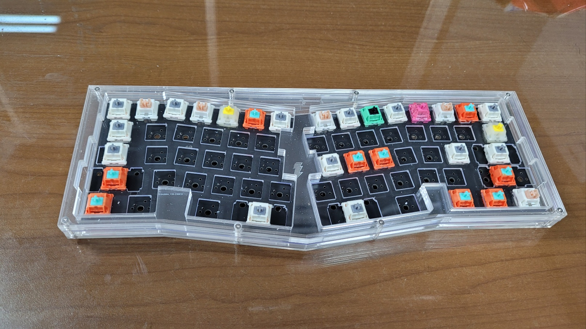
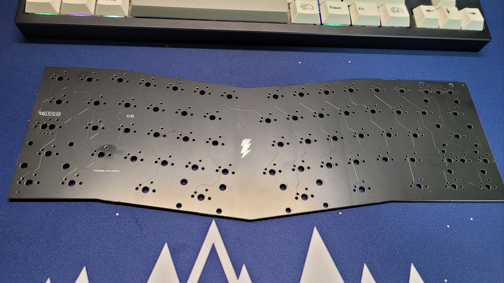

# CoMeridian
Copy of Meridian, but not exactly same.
You can make your own PCB and stacked acrylic housing from the files on this repo.

## Features

### PCB
  - Powered by RP2040, with 4MB flash memory storage
  - Almostly same layout with Ai03's Meridian
  - Support multi layout. Backspace split, Right Shift split, and Stepped/Normal CapsLock selection
  - Current version is for only solder, without any light. Hotswap and RGB lights will be added later

### Plate
  - Also supports multi layout
  - You may want un-transparent colored plate to cover my logo ;P

## What you need to build this
1. PCB (It's ready-to-make, given gerber, BOM, and POS) *1.6mm is recommended, I never tried 1.2mm.
2. Lasercut acrylic plates for housing, plus one PC plate (the files are given)
3. Unified Daugter Board C-Legacy version
4. JST SH 1mm Male to Male cable. Just 5cm would be fine, but 10cm or a little bit longer also can be used.
5. Standoffs, M2x14mm *8, M2x8mm * 4
6. Bolts, M2x6mm *24 (or M2x8mm if you don't want to countersink holes for countersunk head bolts)

## How to flash your PCB
Just plug it in and Drag&Drop .uf2 firmware file
